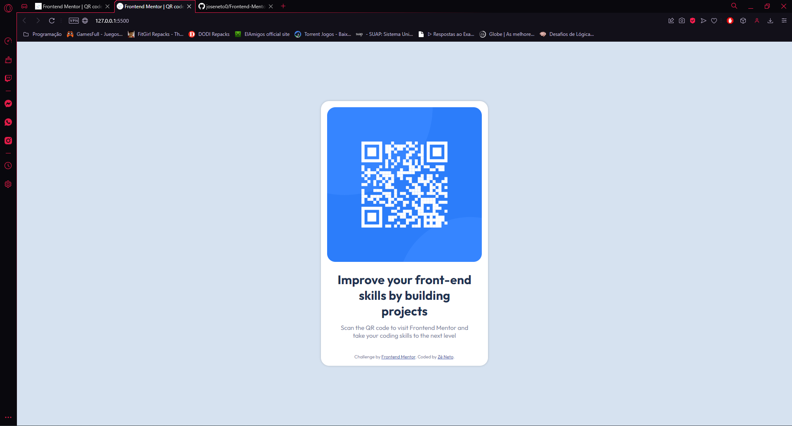

# Frontend Mentor - QR code component solution

This is a solution to the [QR code component challenge on Frontend Mentor](https://www.frontendmentor.io/challenges/qr-code-component-iux_sIO_H). Frontend Mentor challenges help you improve your coding skills by building realistic projects. 

## Overview

### Screenshot

### Links

- Solution URL: [Add solution URL here](https://github.com/joseneto0/Frontend-Mentor/tree/main/qr-code-component-main)
- Live Site URL: [Add live site URL here](https://joseneto0.github.io/Frontend-Mentor/qr-code-component-main/)

### Built with

- Semantic HTML5 markup
- CSS custom properties
- Flexbox

### What I learned

I learned flexbox concepts that I didn't know, in addition to other particularities of html and css